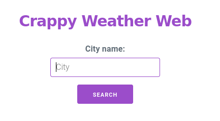
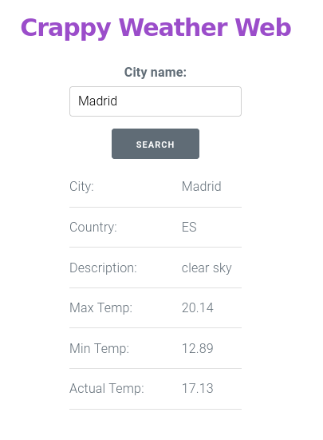

# About the Code

Frontend made with Angular and TypeScript, which communicates with the backend made with Java Spring. This backend communicates with the API: [OpenWeather](openweathermap.org)  
It doesn't make to much sense to use Java Spring, since we could make the API calls from Angular, but I want to learn Java Spring so :/

### How Does It Look Like
  


## Installation
- You need an OpenWeather account and key: [How to start](https://openweathermap.org/appid)
- You need `maven` and `angular`

## Run
- Set an `env` variable called `OPEN_WEATHER` with yout weather key:
```bash
export OPEN_WEATHER=your_openweather_key
```
- Then open a terminal and inside `weather_backend` run:
```bash
mvn spring-boot:run
```
- Open another terminal and inside `weather_frontend` run:
```bash
npm install -g @angular/cli
npm i
ng serve --open
```
- A web page should open inside your web browser :D
